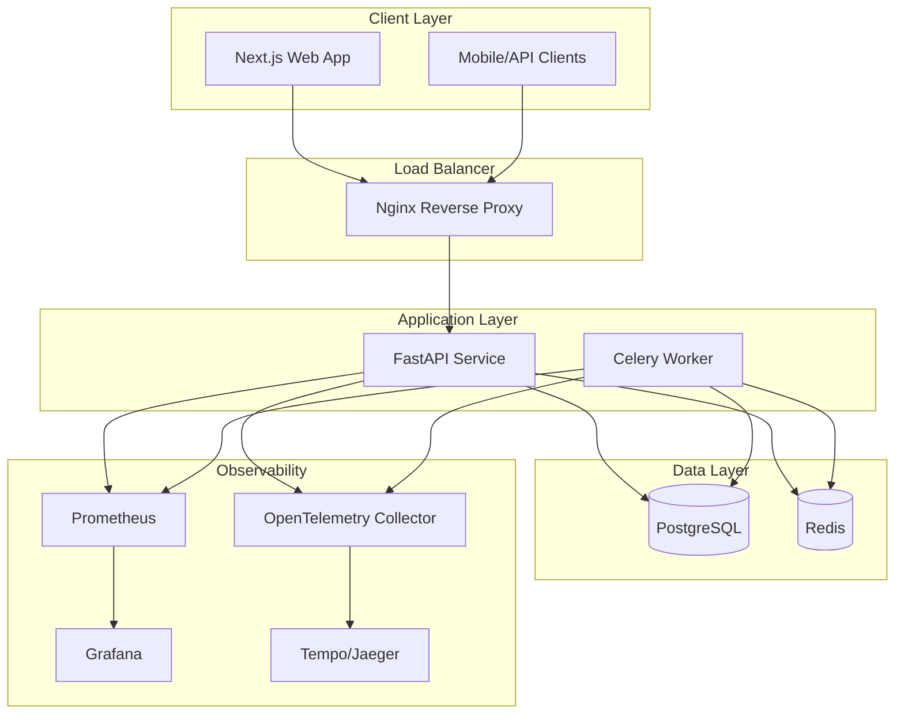

# Ghostworks SaaS Platform Design Document

## Overview

Ghostworks is designed as a production-grade, AI-native multi-tenant SaaS platform that demonstrates autonomous development capabilities. The architecture follows modern cloud-native patterns with a focus on observability, security, and developer experience. The system uses a monorepo structure with clear service boundaries and comprehensive automation.

### Key Design Principles

- **Multi-tenancy by design**: Tenant isolation at database and application layers
- **Observability first**: Comprehensive telemetry from day one
- **Security by default**: ASVS-aligned security practices throughout
- **AI-native workflows**: MCP integration and autonomous agent capabilities
- **Production readiness**: Full CI/CD, monitoring, and operational tooling

## Architecture

### High-Level Architecture



### Monorepo Structure

```
ghostworks/
├── apps/
│   └── web/                 # Next.js frontend application
├── services/
│   ├── api/                 # FastAPI backend service
│   └── worker/              # Celery background worker
├── packages/
│   └── shared/              # Shared TypeScript/Python utilities
├── infra/
│   ├── docker/              # Docker Compose configurations
│   └── terraform/           # Infrastructure as Code
├── tests/
│   ├── api/                 # API integration tests
│   ├── e2e/                 # End-to-end tests
│   ├── perf/                # Performance tests
│   └── unit/                # Unit test utilities
├── docs/
│   └── adr/                 # Architecture Decision Records
└── .kiro/
    ├── specs/               # Feature specifications
    └── steering/            # AI development guidance
```

## Components and Interfaces

### Frontend Application (Next.js)

**Technology Stack:**
- Next.js 14+ with App Router
- TypeScript for type safety
- Tailwind CSS for styling
- React Query for state management
- Playwright for E2E testing

**Key Features:**
- Server-side rendering for SEO and performance
- Optimistic UI updates for better UX
- Progressive Web App capabilities
- Comprehensive error boundaries

**API Integration:**
```typescript
interface ApiClient {
  auth: AuthService;
  artifacts: ArtifactService;
  workspaces: WorkspaceService;
}

interface ArtifactService {
  create(artifact: CreateArtifactRequest): Promise<Artifact>;
  list(params: ListParams): Promise<PaginatedResponse<Artifact>>;
  search(query: SearchQuery): Promise<SearchResults<Artifact>>;
  update(id: string, updates: UpdateArtifactRequest): Promise<Artifact>;
  delete(id: string): Promise<void>;
}
```

### Backend API Service (FastAPI)

**Technology Stack:**
- FastAPI with async/await support
- SQLAlchemy 2.0 with async support
- Alembic for database migrations
- Pydantic v2 for data validation
- JWT for authentication

**Core Models:**
```python
class Tenant(BaseModel):
    id: UUID
    name: str
    slug: str
    created_at: datetime
    settings: dict[str, Any]

class User(BaseModel):
    id: UUID
    email: EmailStr
    hashed_password: str
    is_verified: bool
    created_at: datetime

class WorkspaceMembership(BaseModel):
    id: UUID
    user_id: UUID
    tenant_id: UUID
    role: WorkspaceRole
    created_at: datetime

class Artifact(BaseModel):
    id: UUID
    tenant_id: UUID  # Tenant isolation
    name: str
    description: str | None
    tags: list[str]
    metadata: dict[str, Any]
    created_by: UUID
    created_at: datetime
    updated_at: datetime
```

**API Structure:**
- `/api/v1/auth/` - Authentication endpoints
- `/api/v1/workspaces/` - Workspace management
- `/api/v1/artifacts/` - Artifact CRUD operations
- `/api/v1/health/` - Health checks and metrics
- `/metrics` - Prometheus metrics endpoint

### Background Worker Service (Celery)

**Technology Stack:**
- Celery with Redis broker
- Shared database models with API service
- OpenTelemetry instrumentation
- Structured logging

**Task Categories:**
- Email notifications and verification
- Data processing and analytics
- Scheduled maintenance tasks
- Integration webhooks

### Multi-Tenant Data Model

**Tenant Isolation Strategy:**
- Row-Level Security (RLS) in PostgreSQL
- Tenant ID in all domain tables
- Connection pooling per tenant
- Encrypted tenant-specific data

**Database Schema:**
```sql
-- Core tenant table
CREATE TABLE tenants (
    id UUID PRIMARY KEY DEFAULT gen_random_uuid(),
    name VARCHAR(255) NOT NULL,
    slug VARCHAR(100) UNIQUE NOT NULL,
    settings JSONB DEFAULT '{}',
    created_at TIMESTAMP WITH TIME ZONE DEFAULT NOW()
);

-- User management
CREATE TABLE users (
    id UUID PRIMARY KEY DEFAULT gen_random_uuid(),
    email VARCHAR(255) UNIQUE NOT NULL,
    hashed_password VARCHAR(255) NOT NULL,
    is_verified BOOLEAN DEFAULT FALSE,
    created_at TIMESTAMP WITH TIME ZONE DEFAULT NOW()
);

-- Workspace membership with RBAC
CREATE TABLE workspace_memberships (
    id UUID PRIMARY KEY DEFAULT gen_random_uuid(),
    user_id UUID REFERENCES users(id) ON DELETE CASCADE,
    tenant_id UUID REFERENCES tenants(id) ON DELETE CASCADE,
    role VARCHAR(50) NOT NULL CHECK (role IN ('owner', 'admin', 'member')),
    created_at TIMESTAMP WITH TIME ZONE DEFAULT NOW(),
    UNIQUE(user_id, tenant_id)
);

-- Artifacts with tenant isolation
CREATE TABLE artifacts (
    id UUID PRIMARY KEY DEFAULT gen_random_uuid(),
    tenant_id UUID REFERENCES tenants(id) ON DELETE CASCADE,
    name VARCHAR(255) NOT NULL,
    description TEXT,
    tags TEXT[] DEFAULT '{}',
    metadata JSONB DEFAULT '{}',
    created_by UUID REFERENCES users(id),
    created_at TIMESTAMP WITH TIME ZONE DEFAULT NOW(),
    updated_at TIMESTAMP WITH TIME ZONE DEFAULT NOW()
);

-- Enable RLS
ALTER TABLE artifacts ENABLE ROW LEVEL SECURITY;
CREATE POLICY tenant_isolation ON artifacts FOR ALL TO authenticated_users USING (tenant_id = current_setting('app.current_tenant_id')::UUID);
```

## Data Models

### Authentication and Authorization

**JWT Token Structure:**
```json
{
  "sub": "user_id",
  "email": "user@example.com",
  "tenant_id": "tenant_uuid",
  "role": "admin",
  "exp": 1234567890,
  "iat": 1234567890
}
```

**Role-Based Access Control:**
- **Owner**: Full workspace control, billing, member management
- **Admin**: User management, artifact management, settings
- **Member**: Artifact read/write within workspace

### Artifact Management

**Artifact Entity:**
- Supports flexible metadata through JSONB
- Full-text search on name, description, and tags
- Audit trail for all modifications
- Soft delete with retention policies

**Search and Filtering:**
```python
class ArtifactSearchQuery(BaseModel):
    q: str | None = None  # Full-text search
    tags: list[str] = []  # Tag filtering
    created_after: datetime | None = None
    created_before: datetime | None = None
    limit: int = Field(default=20, le=100)
    offset: int = Field(default=0, ge=0)
```

## Error Handling

### API Error Response Format

```python
class ErrorResponse(BaseModel):
    error: str
    message: str
    details: dict[str, Any] | None = None
    request_id: str
    timestamp: datetime

class ValidationErrorResponse(ErrorResponse):
    validation_errors: list[ValidationError]
```

### Error Categories

1. **Authentication Errors (401)**
   - Invalid or expired tokens
   - Missing authentication

2. **Authorization Errors (403)**
   - Insufficient permissions
   - Tenant access violations

3. **Validation Errors (422)**
   - Invalid input data
   - Business rule violations

4. **Not Found Errors (404)**
   - Resource doesn't exist
   - Tenant isolation violations

5. **Rate Limiting (429)**
   - API rate limits exceeded
   - Resource quotas exceeded

### Global Exception Handling

```python
@app.exception_handler(ValidationError)
async def validation_exception_handler(request: Request, exc: ValidationError):
    return JSONResponse(
        status_code=422,
        content=ErrorResponse(
            error="validation_error",
            message="Invalid input data",
            details={"validation_errors": exc.errors()},
            request_id=request.state.request_id,
            timestamp=datetime.utcnow()
        ).dict()
    )
```

## Testing Strategy

### Unit Testing

**Backend (pytest):**
- Model validation and business logic
- Service layer functionality
- Database operations with test fixtures
- Mock external dependencies

**Frontend (Vitest):**
- Component rendering and behavior
- Utility functions and hooks
- State management logic
- API client functionality

### Integration Testing

**API Testing:**
- Full request/response cycles
- Database integration
- Authentication flows
- Multi-tenant isolation

**Contract Testing:**
- OpenAPI specification validation
- Request/response schema compliance
- Backward compatibility checks

### End-to-End Testing

**Playwright Tests:**
- Critical user journeys
- Multi-tenant workflows
- Authentication and authorization
- Cross-browser compatibility

**Test Data Management:**
- Isolated test databases
- Fixture factories for consistent data
- Cleanup strategies for test isolation

### Performance Testing

**K6 Load Tests:**
- API endpoint performance
- Database query optimization
- Concurrent user scenarios
- Resource utilization monitoring

**Performance Targets:**
- P95 API response time < 200ms
- Database queries < 50ms
- Frontend page load < 2s
- Worker task processing < 5s

## Security Architecture

### Authentication Security

**Password Security:**
- bcrypt hashing with salt rounds >= 12
- Password complexity requirements
- Account lockout after failed attempts
- Secure password reset flows

**JWT Security:**
- Short-lived access tokens (15 minutes)
- Longer refresh tokens (7 days)
- Token rotation on refresh
- Secure token storage (httpOnly cookies)

### Input Validation and Sanitization

**API Layer:**
- Pydantic models for all inputs
- SQL injection prevention via ORM
- XSS protection through output encoding
- CSRF protection for state-changing operations

**Database Layer:**
- Parameterized queries only
- Row-level security policies
- Connection pooling with limits
- Query timeout enforcement

### Security Headers

```python
security_headers = {
    "X-Content-Type-Options": "nosniff",
    "X-Frame-Options": "DENY",
    "X-XSS-Protection": "1; mode=block",
    "Strict-Transport-Security": "max-age=31536000; includeSubDomains",
    "Content-Security-Policy": "default-src 'self'; script-src 'self' 'unsafe-inline'",
    "Referrer-Policy": "strict-origin-when-cross-origin"
}
```

## Observability and Monitoring

### Metrics Collection

**Golden Signals:**
- **Latency**: Request duration percentiles
- **Traffic**: Requests per second by endpoint
- **Errors**: Error rate by status code
- **Saturation**: Resource utilization metrics

**Custom Metrics:**
```python
# Business metrics
artifacts_created_total = Counter('artifacts_created_total', 'Total artifacts created', ['tenant_id'])
user_registrations_total = Counter('user_registrations_total', 'Total user registrations')
workspace_activity = Histogram('workspace_activity_duration', 'Time spent in workspace')

# Technical metrics
db_connection_pool = Gauge('db_connection_pool_size', 'Database connection pool size')
celery_task_duration = Histogram('celery_task_duration_seconds', 'Celery task duration', ['task_name'])
```

### Distributed Tracing

**OpenTelemetry Configuration:**
- Automatic instrumentation for FastAPI, SQLAlchemy, Redis
- Custom spans for business operations
- Trace correlation across services
- Sampling strategies for production

**Trace Attributes:**
```python
@tracer.start_as_current_span("artifact.create")
def create_artifact(artifact_data: CreateArtifactRequest, tenant_id: str):
    span = trace.get_current_span()
    span.set_attribute("tenant.id", tenant_id)
    span.set_attribute("artifact.name", artifact_data.name)
    span.set_attribute("artifact.tags_count", len(artifact_data.tags))
```

### Structured Logging

**Log Format:**
```json
{
  "timestamp": "2024-01-15T10:30:00Z",
  "level": "INFO",
  "service": "api",
  "request_id": "req_123456",
  "tenant_id": "tenant_uuid",
  "user_id": "user_uuid",
  "operation": "artifact.create",
  "duration_ms": 45,
  "status": "success",
  "message": "Artifact created successfully"
}
```

### Alerting Strategy

**Critical Alerts:**
- API error rate > 5%
- P95 latency > 500ms
- Database connection failures
- Worker queue backlog > 1000

**Warning Alerts:**
- API error rate > 1%
- P95 latency > 200ms
- High memory usage > 80%
- Disk space < 20%

## Deployment and Infrastructure

### Container Strategy

**Multi-stage Docker builds:**
- Optimized layer caching
- Security scanning integration
- Minimal runtime images
- Health check endpoints

### Environment Configuration

**12-Factor Compliance:**
```python
class Settings(BaseSettings):
    database_url: PostgresDsn
    redis_url: RedisDsn
    jwt_secret_key: SecretStr
    opentelemetry_endpoint: HttpUrl
    log_level: str = "INFO"
    
    class Config:
        env_file = ".env"
        case_sensitive = False
```

### CI/CD Pipeline

**GitHub Actions Workflow:**
1. Code quality checks (linting, formatting)
2. Security scanning (SAST, dependency check)
3. Unit and integration tests
4. Build and push container images
5. Deploy to staging environment
6. Run E2E tests
7. Performance testing
8. Production deployment (manual approval)

## AI Integration and Automation

### MCP Server Configuration

**GitHub Integration:**
- Repository management
- Issue and PR creation
- Code search and analysis
- Release management

**AWS Documentation:**
- Service documentation lookup
- Best practices guidance
- Architecture pattern suggestions

### Agent Hooks

**Asset Gardener Hook:**
- Image optimization pipeline
- Responsive variant generation
- Import map updates
- Performance impact analysis

**Release Notes Hook:**
- Conventional commit parsing
- CHANGELOG.md generation
- Release note compilation
- Version tagging automation

### Steering Documents Integration

**Context-Aware Guidance:**
- Security policies for service code
- Testing standards for test files
- Code conventions for all files
- Deployment workflows for CI/CD

This design provides a comprehensive foundation for building Ghostworks as a production-grade, AI-native SaaS platform with all the modern capabilities required for a successful multi-tenant application.