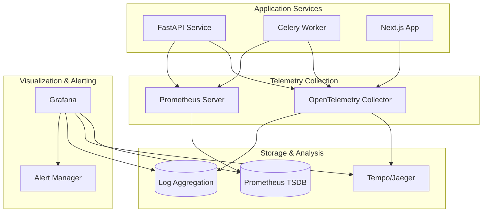

# ADR-0003: Observability and Monitoring Approach

## Status
Accepted

## Context
Ghostworks requires comprehensive observability to ensure system reliability, performance, and operational excellence. As a production-grade SaaS platform, we need to:

1. Monitor system health and performance in real-time
2. Quickly identify and diagnose issues across distributed services
3. Track business metrics and user behavior
4. Ensure SLA compliance and performance targets
5. Enable proactive alerting before issues impact users
6. Support debugging and root cause analysis
7. Provide visibility into multi-tenant resource usage

Key observability requirements:
- **Metrics**: Golden signals (latency, traffic, errors, saturation) and business metrics
- **Logs**: Structured, searchable logs with correlation IDs
- **Traces**: Distributed tracing across service boundaries
- **Dashboards**: Real-time visualization of system and business health
- **Alerting**: Proactive notifications for critical issues
- **Cost-effective**: Efficient data collection and storage

## Decision
We have implemented a comprehensive observability stack based on **OpenTelemetry, Prometheus, and Grafana**:

### Core Observability Stack
1. **OpenTelemetry**: Unified telemetry collection (traces, metrics, logs)
2. **Prometheus**: Metrics collection and storage with PromQL queries
3. **Grafana**: Visualization, dashboards, and alerting
4. **OpenTelemetry Collector**: Centralized telemetry processing and export
5. **Structured Logging**: JSON logs with correlation and context

### Architecture Overview


### Implementation Components

#### 1. OpenTelemetry Instrumentation
```python
# FastAPI service telemetry setup
from opentelemetry import trace
from opentelemetry.exporter.otlp.proto.grpc.trace_exporter import OTLPSpanExporter
from opentelemetry.instrumentation.fastapi import FastAPIInstrumentor
from opentelemetry.instrumentation.sqlalchemy import SQLAlchemyInstrumentor

# Initialize tracing
tracer = trace.get_tracer(__name__)

# Automatic instrumentation
FastAPIInstrumentor.instrument_app(app)
SQLAlchemyInstrumentor().instrument(engine=engine)

# Custom spans for business operations
@tracer.start_as_current_span("artifact.create")
async def create_artifact(data: ArtifactCreate, user_id: str):
    span = trace.get_current_span()
    span.set_attribute("tenant.id", data.tenant_id)
    span.set_attribute("user.id", user_id)
    span.set_attribute("artifact.tags_count", len(data.tags))
    
    # Business logic with automatic tracing
    return await artifact_repository.create(data)
```

#### 2. Prometheus Metrics
```python
# Golden signals and business metrics
from prometheus_client import Counter, Histogram, Gauge

# Golden signals
request_duration = Histogram(
    'http_request_duration_seconds',
    'HTTP request duration',
    ['method', 'endpoint', 'status_code']
)

request_count = Counter(
    'http_requests_total',
    'Total HTTP requests',
    ['method', 'endpoint', 'status_code']
)

# Business metrics
artifacts_created = Counter(
    'artifacts_created_total',
    'Total artifacts created',
    ['tenant_id']
)

active_users = Gauge(
    'active_users_current',
    'Currently active users',
    ['tenant_id']
)

# Database metrics
db_connections = Gauge(
    'database_connections_active',
    'Active database connections'
)
```

#### 3. Structured Logging
```python
import structlog

# Configure structured logging
structlog.configure(
    processors=[
        structlog.contextvars.merge_contextvars,
        structlog.processors.add_log_level,
        structlog.processors.TimeStamper(fmt="iso"),
        structlog.dev.ConsoleRenderer() if DEBUG else structlog.processors.JSONRenderer()
    ],
    wrapper_class=structlog.make_filtering_bound_logger(logging.INFO),
    logger_factory=structlog.PrintLoggerFactory(),
    cache_logger_on_first_use=True,
)

logger = structlog.get_logger()

# Usage with context
async def create_artifact(data: ArtifactCreate, user_id: str):
    logger.info(
        "Creating artifact",
        tenant_id=data.tenant_id,
        user_id=user_id,
        artifact_name=data.name,
        tags_count=len(data.tags)
    )
```

#### 4. Grafana Dashboards
**API Golden Signals Dashboard**:
- Request rate (RPS) by endpoint
- Request duration percentiles (P50, P95, P99)
- Error rate by status code
- Active connections and resource usage

**Business Metrics Dashboard**:
- User registrations and activity
- Artifact creation and usage trends
- Tenant-specific metrics
- Revenue and usage analytics

**System Overview Dashboard**:
- Infrastructure health (CPU, memory, disk)
- Database performance and connections
- Queue depths and worker status
- Alert status and recent incidents

## Alternatives Considered

### 1. ELK Stack (Elasticsearch, Logstash, Kibana)
**Pros**:
- Mature ecosystem with extensive features
- Powerful log search and analysis
- Good visualization capabilities

**Cons**:
- High resource usage and operational overhead
- Complex setup and maintenance
- Expensive licensing for advanced features
- Primarily log-focused, weaker metrics story

**Rejected**: Too heavy for our current scale and requirements.

### 2. DataDog/New Relic (Commercial SaaS)
**Pros**:
- Fully managed service
- Excellent user experience
- Advanced ML-based alerting
- Comprehensive integrations

**Cons**:
- High cost at scale
- Vendor lock-in
- Data privacy concerns (external hosting)
- Less customization flexibility

**Rejected**: Cost and vendor lock-in concerns for a platform demonstrating autonomy.

### 3. Jaeger + InfluxDB + Grafana
**Pros**:
- Purpose-built tracing with Jaeger
- Time-series optimized with InfluxDB
- Good performance characteristics

**Cons**:
- Multiple systems to maintain
- Different query languages (InfluxQL vs PromQL)
- Less ecosystem integration

**Rejected**: OpenTelemetry + Prometheus provides better standardization.

### 4. Simple Logging + Basic Monitoring
**Pros**:
- Minimal complexity and overhead
- Easy to implement and maintain
- Low resource usage

**Cons**:
- Limited debugging capabilities
- No distributed tracing
- Poor visibility into system behavior
- Reactive rather than proactive

**Rejected**: Insufficient for production SaaS requirements.

### 5. Cloud Provider Solutions (AWS CloudWatch, etc.)
**Pros**:
- Integrated with cloud infrastructure
- Managed service benefits
- Good integration with other cloud services

**Cons**:
- Vendor lock-in to specific cloud provider
- Limited customization options
- Can be expensive at scale
- Less flexibility for custom metrics

**Rejected**: Platform should be cloud-agnostic and demonstrate open-source capabilities.

## Consequences

### Positive Consequences

1. **Comprehensive Visibility**: Full observability across all system components
2. **Industry Standards**: OpenTelemetry ensures vendor-neutral, future-proof telemetry
3. **Cost Effective**: Open-source stack with predictable resource usage
4. **Developer Experience**: Rich debugging capabilities with distributed tracing
5. **Operational Excellence**: Proactive alerting and performance monitoring
6. **Scalability**: Prometheus and Grafana scale well with proper configuration
7. **Flexibility**: Highly customizable dashboards and alerting rules
8. **Multi-tenant Insights**: Tenant-specific metrics and resource usage tracking

### Negative Consequences

1. **Operational Overhead**: Multiple services to deploy, configure, and maintain
2. **Learning Curve**: Team needs expertise in Prometheus, Grafana, and OpenTelemetry
3. **Storage Requirements**: Metrics and traces require significant storage over time
4. **Performance Impact**: Telemetry collection adds small overhead to applications
5. **Configuration Complexity**: Proper setup requires careful tuning and optimization

### Risk Mitigation Strategies

1. **Documentation**: Comprehensive runbooks for common operations and troubleshooting
2. **Automation**: Infrastructure as Code for consistent deployments
3. **Training**: Team education on observability best practices
4. **Gradual Rollout**: Implement observability incrementally with proper testing
5. **Resource Management**: Proper retention policies and storage optimization
6. **Backup Strategy**: Regular backups of Grafana dashboards and Prometheus config

## Implementation Details

### Metrics Collection Strategy
```yaml
# Prometheus scrape configuration
scrape_configs:
  - job_name: 'api-service'
    static_configs:
      - targets: ['api:8000']
    scrape_interval: 15s
    metrics_path: '/metrics'
    
  - job_name: 'worker-service'
    static_configs:
      - targets: ['worker:8001']
    scrape_interval: 30s
```

### OpenTelemetry Collector Configuration
```yaml
# otelcol-config.yml
receivers:
  otlp:
    protocols:
      grpc:
        endpoint: 0.0.0.0:4317
      http:
        endpoint: 0.0.0.0:4318

processors:
  batch:
    timeout: 1s
    send_batch_size: 1024
  
  resource:
    attributes:
      - key: service.environment
        value: production
        action: upsert

exporters:
  jaeger:
    endpoint: jaeger:14250
    tls:
      insecure: true
  
  prometheus:
    endpoint: "0.0.0.0:8889"

service:
  pipelines:
    traces:
      receivers: [otlp]
      processors: [batch, resource]
      exporters: [jaeger]
    
    metrics:
      receivers: [otlp]
      processors: [batch, resource]
      exporters: [prometheus]
```

### Alerting Rules
```yaml
# Grafana alerting rules
groups:
  - name: api-health
    rules:
      - alert: HighErrorRate
        expr: rate(http_requests_total{status_code=~"5.."}[5m]) > 0.05
        for: 2m
        labels:
          severity: critical
        annotations:
          summary: "High error rate detected"
          description: "API error rate is {{ $value }} requests/sec"
      
      - alert: HighLatency
        expr: histogram_quantile(0.95, rate(http_request_duration_seconds_bucket[5m])) > 0.5
        for: 5m
        labels:
          severity: warning
        annotations:
          summary: "High API latency detected"
          description: "95th percentile latency is {{ $value }}s"
```

### Dashboard Configuration
```json
{
  "dashboard": {
    "title": "API Golden Signals",
    "panels": [
      {
        "title": "Request Rate",
        "type": "graph",
        "targets": [
          {
            "expr": "rate(http_requests_total[5m])",
            "legendFormat": "{{method}} {{endpoint}}"
          }
        ]
      },
      {
        "title": "Error Rate",
        "type": "stat",
        "targets": [
          {
            "expr": "rate(http_requests_total{status_code=~\"5..\"}[5m]) / rate(http_requests_total[5m])",
            "legendFormat": "Error Rate"
          }
        ]
      }
    ]
  }
}
```

## Monitoring Strategy

### Golden Signals Implementation
1. **Latency**: P50, P95, P99 response times for all endpoints
2. **Traffic**: Request rate by endpoint, method, and tenant
3. **Errors**: Error rate by status code and error type
4. **Saturation**: Resource utilization (CPU, memory, connections)

### Business Metrics
- User registration and activation rates
- Artifact creation and usage patterns
- Tenant growth and churn metrics
- Feature adoption and usage analytics

### Infrastructure Metrics
- Database performance and connection pools
- Queue depths and worker performance
- Container resource usage
- Network and disk I/O

## Performance Considerations

### Telemetry Overhead
- **Tracing**: ~1-3% CPU overhead with 1% sampling in production
- **Metrics**: ~0.5% CPU overhead with 15-second scrape intervals
- **Logging**: ~2-5% overhead with structured JSON logging

### Storage Requirements
- **Metrics**: ~1KB per metric per scrape interval
- **Traces**: ~10KB per trace (with sampling)
- **Logs**: ~500 bytes per log entry

### Retention Policies
- **Metrics**: 30 days high resolution, 1 year downsampled
- **Traces**: 7 days for detailed traces
- **Logs**: 30 days for application logs, 90 days for audit logs

## Testing Strategy
- Load testing with telemetry enabled to measure overhead
- Chaos engineering to validate alerting and monitoring
- Regular review of dashboard accuracy and alert effectiveness
- Performance benchmarking of observability stack components

## References
- [OpenTelemetry Documentation](https://opentelemetry.io/docs/)
- [Prometheus Best Practices](https://prometheus.io/docs/practices/)
- [Grafana Dashboard Design](https://grafana.com/docs/grafana/latest/best-practices/)
- [Google SRE Book - Monitoring Distributed Systems](https://sre.google/sre-book/monitoring-distributed-systems/)
- [The Four Golden Signals](https://sre.google/sre-book/monitoring-distributed-systems/#xref_monitoring_golden-signals)