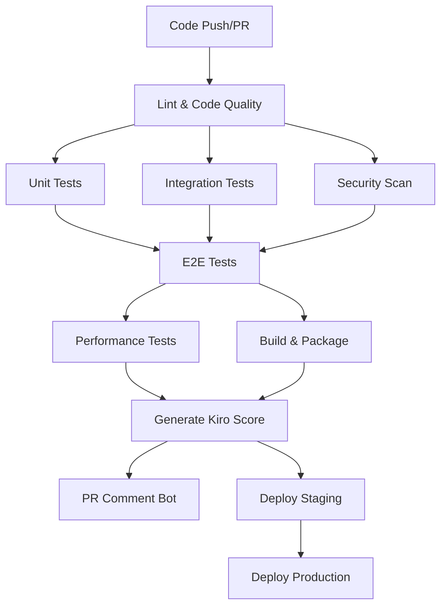

# CI/CD Pipeline Documentation

This document describes the comprehensive CI/CD pipeline for the Ghostworks SaaS platform.

## Overview

The CI/CD pipeline is designed to ensure code quality, security, and performance through automated testing, security scanning, and deployment processes. It follows industry best practices and provides comprehensive feedback through the Kiro scoring system.

## Pipeline Architecture

## Pipeline Jobs

### 1. Code Quality & Linting (`lint`)

**Purpose**: Ensures code follows established conventions and standards.

**Tools Used**:
- ESLint for TypeScript/JavaScript
- Flake8, Black, isort for Python
- MyPy for Python type checking

**Triggers**: All pushes and PRs

**Artifacts**: None

### 2. Unit Tests (`test-unit`)

**Purpose**: Validates individual components and functions work correctly.

**Coverage Targets**:
- Backend: ≥70%
- Frontend: ≥60%

**Tools Used**:
- pytest for Python backend
- Vitest for React frontend
- Coverage.py and Vitest coverage

**Services Required**:
- PostgreSQL 15
- Redis 7

**Artifacts**:
- `pytest-unit-results.xml`
- `vitest-results.xml`
- `coverage.xml`

### 3. Integration Tests (`test-integration`)

**Purpose**: Tests API endpoints and database interactions.

**Tools Used**:
- pytest with test database
- Alembic migrations
- SQLAlchemy fixtures

**Services Required**:
- PostgreSQL 15
- Redis 7

**Artifacts**:
- `pytest-integration-results.xml`
- `coverage.xml`

### 4. End-to-End Tests (`test-e2e`)

**Purpose**: Validates complete user workflows across the full stack.

**Tools Used**:
- Playwright for browser automation
- Docker Compose for service orchestration
- Full application stack

**Test Scenarios**:
- User authentication flows
- Workspace management
- Artifact CRUD operations
- Multi-tenant isolation

**Artifacts**:
- `playwright-report/`

### 5. Security Scanning (`security-scan`)

**Purpose**: Identifies security vulnerabilities and compliance issues.

**Tools Used**:
- OWASP ZAP baseline scan
- npm audit for Node.js dependencies
- Safety for Python dependencies
- Bandit for Python security issues

**Scan Targets**:
- Running API endpoints
- Dependency vulnerabilities
- Static code analysis

**Artifacts**:
- `safety-report.json`
- `bandit-report.json`
- `report_html.html` (ZAP)
- `report_json.json` (ZAP)

### 6. Performance Tests (`test-performance`)

**Purpose**: Ensures API performance meets requirements.

**Tools Used**:
- k6 for load testing
- Custom performance scenarios

**Performance Targets**:
- P95 response time: <200ms (route-class specific)
- Error rate: <1%
- Concurrent users: 100+

**Artifacts**:
- `performance-results.json`

### 7. Build & Package (`build`)

**Purpose**: Creates deployable artifacts and container images.

**Tools Used**:
- Docker Buildx
- GitHub Container Registry
- Multi-stage builds

**Outputs**:
- Container images tagged with branch/SHA
- Build metadata and labels

### 8. Generate Kiro Score (`generate-score`)

**Purpose**: Aggregates all quality metrics into a comprehensive score.

**Scoring Algorithm**:
- Tests (35%): Pass rate across all test types
- Coverage (25%): Weighted average of backend/frontend coverage
- Performance (20%): Based on P95 latency vs. target
- Security (15%): Vulnerability count and severity
- Build (5%): Build success/failure

**Grade Scale & Deployment Actions**:
- **A+ to A- (≥85)**: AUTO_DEPLOY - Automatic deployment approved
- **B+ to B- (70-84)**: MANUAL_REVIEW - Human judgment required
- **C+ to C- (55-69)**: BLOCK_WITH_OVERRIDE - Emergency override possible
- **D to F (<55)**: BLOCK - Hard deployment block

**Artifacts**:
- `kiro_score.json`

### 9. PR Comment Bot (`pr-comment`)

**Purpose**: Provides comprehensive feedback on pull requests.

**Features**:
- Detailed test results table
- Coverage visualization with progress bars
- Performance metrics vs. targets
- Security scan summary
- **Direct artifact links** - One-click access to detailed reports
- Actionable recommendations
- Score transparency with rationale

**Comment Updates**: Updates existing comments rather than creating new ones.

### 10. Deployment Jobs

#### Staging Deployment (`deploy-staging`)
- **Trigger**: Push to `main` branch
- **Environment**: `staging`
- **Includes**: Smoke tests after deployment

#### Production Deployment (`deploy-production`)
- **Trigger**: Manual approval after staging
- **Environment**: `production`
- **Includes**: Production smoke tests

## Quality Gates

### PR Requirements
- All linting checks must pass
- Unit test pass rate ≥95%
- Integration test pass rate ≥95%
- No high-severity security vulnerabilities
- Backend coverage ≥70%
- Frontend coverage ≥60%

### Deployment Requirements
- All tests must pass
- Security scan must pass
- Performance targets must be met (route-class specific)
- Kiro score ≥70 (B- grade)

## Performance Thresholds

### Route-Class Specific Targets
- **Health Check**: 50ms P95
- **Authentication**: 150ms P95 (crypto overhead)
- **Simple CRUD**: 200ms P95
- **Heavy Search**: 500ms P95
- **File Upload**: 2000ms P95

### Environment-Specific Thresholds
- **Production**: Aggressive (P95 <150ms, <0.5% error rate)
- **Staging**: Standard (P95 <200ms, <1% error rate)
- **Local Dev**: Lenient (P95 <500ms, <2% error rate, cold-start exclusion)

## Artifacts and Reports

### Test Results
- JUnit XML format for all test types
- Coverage reports in XML and HTML formats
- Playwright HTML reports with screenshots

### Security Reports
- JSON format for programmatic processing
- HTML reports for human review
- Vulnerability details with severity levels

### Performance Reports
- k6 JSON output with detailed metrics
- Response time percentiles
- Error rate analysis

### Kiro Score
- Comprehensive JSON with all metrics
- Score breakdown with rationale
- Actionable recommendations
- Direct links to all artifacts

## Troubleshooting

### Common Issues

#### Test Failures
1. Check test logs in workflow artifacts
2. Verify database migrations are up to date
3. Ensure test data is properly isolated

#### Security Scan Failures
1. Review ZAP report for false positives
2. Update `.zap/rules.tsv` if needed
3. Fix legitimate security issues

#### Performance Issues
1. Check k6 results for bottlenecks
2. Review database query performance
3. Analyze response time distribution

#### Build Failures
1. Verify Docker configuration
2. Check dependency versions
3. Review build logs for errors

### Getting Help

1. Check workflow logs in GitHub Actions
2. Review artifact files for detailed reports
3. Consult the Kiro score recommendations
4. Contact the development team for assistance

## Continuous Improvement

The CI/CD pipeline is continuously improved based on:
- Developer feedback
- Performance metrics
- Security best practices
- Industry standards

Regular reviews ensure the pipeline remains effective and efficient while maintaining high quality standards.